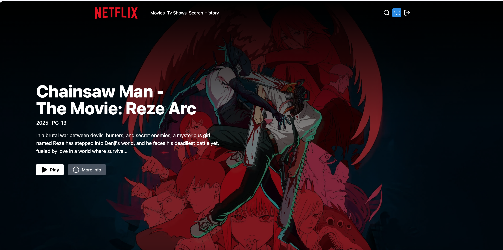
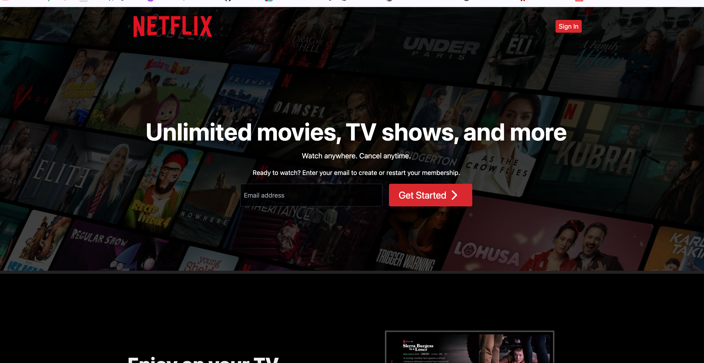
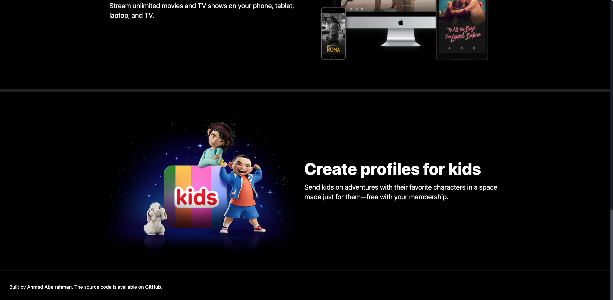
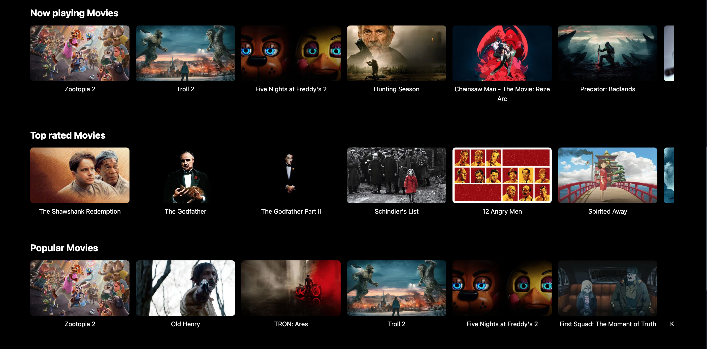
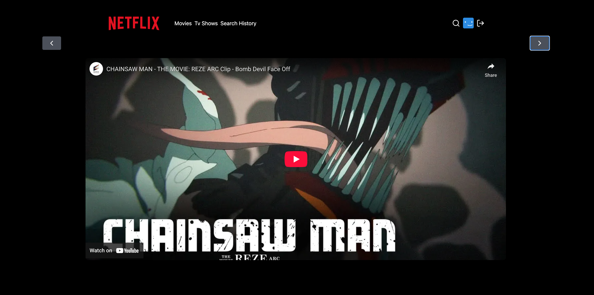
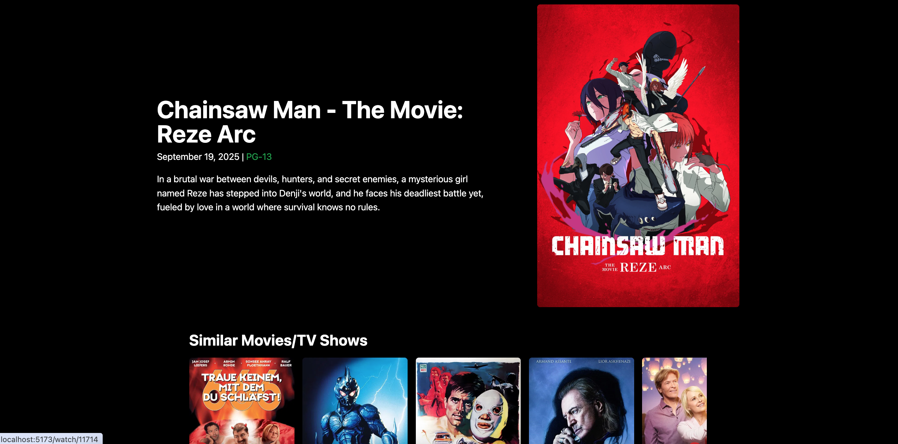
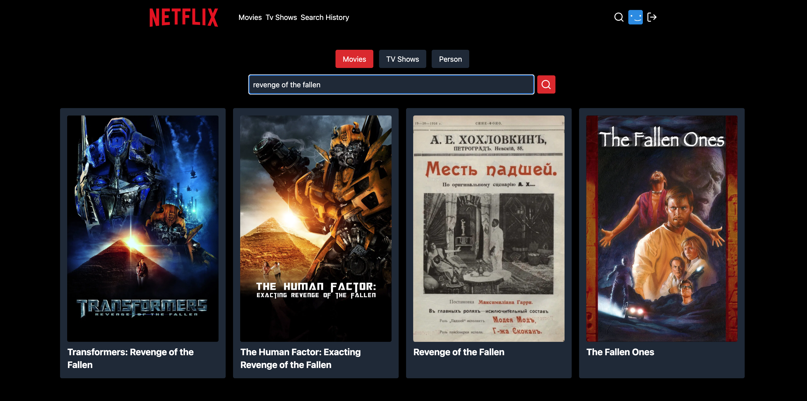
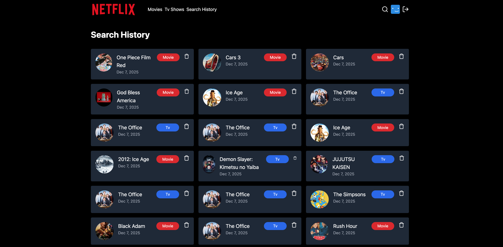

<h1 align="center">MERN Netflix Clone 🎬</h1>

<p align="center">
  
</p>

## 📸 Screenshots

### 🏠 Home & Landing Page

<div align="center">
  
  
  
</div>

### 🔐 Authentication

<div align="center">
  
</div>

### 🎬 Movies & TV Shows

<div align="center">
  
</div>

### 🎥 Watch & Trailer

<div align="center">
  
  
</div>

### 🔎 Search & History

<div align="center">
  
  
</div>

## ✨ Features

- ⚛️ Tech Stack: React.js, Node.js, Express.js, MongoDB, Tailwind
- 🔐 Authentication with JWT
- 📱 Responsive UI
- 🎬 Fetch Movies and Tv Show
- 🔎 Search for Actors and Movies
- 🎥 Watch Trailers
- 🔥 Fetch Search History
- 🐱‍👤 Get Similar Movies/Tv Shows
- 💙 Awesome Landing Page
- 🌐 Deployment
- 🚀 And Many More Cool Features

### Setup .env file

```bash
PORT=5000
MONGO_URI=your_mongo_uri
NODE_ENV=development
JWT_SECRET=your_jwt_secre
TMDB_API_KEY=your_tmdb_api_key
```

### Run this app locally

```shell
npm run build
```

### Start the app

```shell
npm run start
```
